<!-- Hero Terminal Banner with Automatic Theme Switching -->
<picture>
  <source media="(prefers-color-scheme: dark)" srcset="./dark.svg">
  <source media="(prefers-color-scheme: light)" srcset="./light.svg">
  
</picture>

  

<!-- Verified Identity & Social Badges -->

  
  
  
  
  
  

<h3>
  ⚡ Architecting scalable full-stack products, glassmorphism UIs, and autonomous AI integrations.
</h3>

  <strong>Smart India Hackathon 2026 National Finalist</strong> · <strong>B.Tech in IT @ Silver Oak University</strong> 
  Specializing in scalable MERN stack architectures, high-performance FastAPI backends, and applied LLMs (Gemini 2.0, Groq LPU, OpenAI).

---

### 🚀 Production Systems & Featured Projects

<table>
  <tr>
    <td width="50%" valign="top">
      <h4>🌾 <a href="https://github.com/harshm13/AgroBridge-SIH26132">AgroBridge</a> </h4>
      
An AI-driven decision engine and market intelligence platform for farmers. Features predictive price forecasting, intelligent "Sell/Wait" recommendations, and automated buyer matching.

      
<strong>Stack:</strong> <code>React</code> · <code>Python</code> · <code>FastAPI</code> · <code>XGBoost</code> · <code>SHAP</code>

    </td>
    <td width="50%" valign="top">
      <h4>⚡ <a href="https://github.com/harshm13/ProjectAtlas">Project Atlas</a> </h4>
      
Cinematic AI-inspired personal portfolio engineered with a 60FPS particle mesh, dynamic canvas shader physics, reactive audio soundscapes, and glassmorphism styling.

      
<strong>Stack:</strong> <code>React</code> · <code>Vite</code> · <code>Framer Motion</code> · <code>Three.js</code>

    </td>
  </tr>
  <tr>
    <td width="50%" valign="top">
      <h4>📄 <a href="https://github.com/harshm13/ResumeOS">ResumeOS</a></h4>
      
AI Career Operating System featuring a split-screen live builder, real-time ATS score calculation, keyword extraction, and automated resume tailoring.

      
<strong>Stack:</strong> <code>React</code> · <code>Tailwind CSS v4</code> · <code>Framer Motion</code> · <code>AI APIs</code>

    </td>
    <td width="50%" valign="top">
      <h4>💻 <a href="https://github.com/harshm13/NexusVoid">Codex AI – NexusVoid</a></h4>
      
Autonomous AI coding assistant platform featuring prompt workflow management, code execution sandbox, and live multi-language previews.

      
<strong>Stack:</strong> <code>Node.js</code> · <code>Express</code> · <code>React</code> · <code>MongoDB</code> · <code>Groq LPU</code>

    </td>
  </tr>
  <tr>
    <td width="50%" valign="top">
      <h4>✈️ <a href="https://github.com/harshm13/GlobeTrotter-NexusVoid">GlobeTrotter</a> </h4>
      
High-performance travel itinerary planner with automated expense tracking, smart multi-city scheduling, and a responsive glassmorphism UI.

      
<strong>Stack:</strong> <code>React</code> · <code>Node.js</code> · <code>Express</code> · <code>MongoDB</code>

    </td>
    <td width="50%" valign="top">
      <h4>♻️ <a href="https://github.com/harshm13/green_route_project">GreenRoute</a></h4>
      
IoT-inspired smart municipal waste management platform combining gamified recycling rewards with graph-optimized fleet vehicle routing.

      
<strong>Stack:</strong> <code>React</code> · <code>FastAPI</code> · <code>Leaflet Maps</code> · <code>IoT APIs</code>

    </td>
  </tr>
  <tr>
    <td width="50%" valign="top">
      <h4>🚚 <a href="https://github.com/harshm13/TransitOps">TransitOps</a></h4>
      
Enterprise logistics and fleet telemetry management system featuring driver route dispatching, operational analytics, and schedule tracking.

      
<strong>Stack:</strong> <code>React</code> · <code>Express.js</code> · <code>MongoDB</code> · <code>Tailwind CSS</code>

    </td>
    <td width="50%" valign="top">
      <h4>⏱️ <a href="https://github.com/harshm13/LastMinuteLifeSaver">The Last-Minute Life Saver</a></h4>
      
Intelligent AI task prioritizer and algorithmic deadline urgency scheduler built for developers and students managing high-pressure workloads.

      
<strong>Stack:</strong> <code>Python</code> · <code>FastAPI</code> · <code>React</code> · <code>Heuristics Engine</code>

    </td>
  </tr>
  <tr>
    <td colspan="2" valign="top">
      <h4>🧠 <a href="https://github.com/harshm13/TaskMind">TaskMind</a></h4>
      
Premium AI-driven agile workspace with a drag-and-drop Kanban engine, blocker detection, and automated sprint velocity analytics.

      
<strong>Stack:</strong> <code>React</code> · <code>Node.js</code> · <code>MongoDB</code> · <code>Groq API</code>

    </td>
  </tr>
</table>

---

### 🏆 Hackathons & Engineering Achievements

* 🏅 **Smart India Hackathon (SIH) 2026 — National Finalist**  
  *Nominated from Silver Oak University for the National Grand Finale.* Architected **AgroBridge**, a production-grade machine learning platform delivering market price forecasting and transparent trade matchmaking for farmers.
* ⚡ **Vibe2Ship Hackathon — Coding Ninjas x Google for Developers**  
  Rapidly designed, prototyped, and shipped production-ready AI solutions under strict hackathon sprint constraints in India's premier developer competition.
* 🌐 **Odoo x LDCE Hackathon — Team NexusVoid**  
  Engineered the complete full-stack architecture and real-time budgeting algorithms for **GlobeTrotter**.
* 📜 **AI Workshop Certification — TechSquarers**  
  Completed the *"Build Your First AI"* intensive technical training on model training, LLM orchestration, and modern AI engineering pipelines.

---

### 🔧 Tech Arsenal & Engineering Capabilities

**Frontend & Interactive UI**  
`React` · `Vite` · `Tailwind CSS v4` · `Framer Motion` · `Three.js` · `HTML5 / CSS3` · `JavaScript (ES6+)`

**Backend, APIs & Databases**  
`Node.js` · `Express.js` · `FastAPI` · `Python` · `MongoDB` · `RESTful Microservices`

**Artificial Intelligence & Machine Learning**  
`Google Gemini 2.0 API` · `Groq LPU API` · `OpenAI API` · `XGBoost` · `scikit-learn` · `SHAP` · `NumPy / Pandas`

**Tooling, DevOps & Environment**  
`Git` · `GitHub Actions (CI/CD)` · `Linux (Ubuntu)` · `VS Code` · `Vercel` · `C++`

---

### 📈 Current Engineering Focus

* 🚀 **Scaling AgroBridge:** Preparing data pipelines and production ML inference for the Smart India Hackathon 2026 Grand Finale.
* 🤖 **AI SaaS Architecture:** Building intelligent, domain-specific AI micro-SaaS applications using Groq and Gemini.
* 📐 **Foundational Computer Science:** Daily practice in Advanced Data Structures, Algorithms, and Distributed Systems.
* 🎓 **Academic Journey:** Pursuing Bachelor of Technology in Information Technology @ Silver Oak University.

---

### 🌐 Verified Network Endpoints

| Channel | Endpoint | Description |
| :--- | :--- | :--- |
| 🌐 **Portfolio** | [projectatlass.ai.studio](https://projectatlass.ai.studio) | Interactive 60FPS Cinematic Portfolio |
| 💻 **Atlas Code** | [harshm13/ProjectAtlas](https://github.com/harshm13/ProjectAtlas) | Portfolio Source Code & Shader Physics |
| 🐙 **GitHub** | [@harshm13](https://github.com/harshm13) | Open-Source Systems & Research |
| 💼 **LinkedIn** | [@harshm13](https://www.linkedin.com/in/harshm13) | Professional Updates & Career |
| 📸 **Instagram** | [@mehta_harsh13](https://www.instagram.com/mehta_harsh13) | Tech Videos, AI Workflows & Cinematic Code |
| ▶️ **YouTube** | [@harshm13](https://www.youtube.com/@harshm13) | Tech Demos, Tutorials & Hackathon Vlogs |
| 📬 **Direct Email** | [hm1304008@gmail.com](mailto:hm1304008@gmail.com) | Collaboration & Opportunities |

 

⭐ *"Building intelligent systems, one line of code at a time."*

